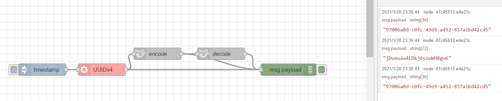

# node-red-contrib-friendly-id
A node for [Node-RED](http://www.nodered.org/) that converts a given UUID to a URL-friendly ID(short-uuid). You can also generate secure ID using [nanoid](https://github.com/ai/nanoid) and [short-uuid](https://github.com/oculus42/short-uuid).

## Installation
Run the following command in the root directory of your Node-RED install:
```shell
$ npm install node-red-contrib-friendly-id
```

## Usage

### Convert from/to UUID 


## Acknowledgements
This project uses the following open source software:
- [short-uuid](https://www.npmjs.com/package/short-uuid) - [MIT License](https://github.com/oculus42/short-uuid/blob/develop/LICENSE)
- [nanoid](https://www.npmjs.com/package/nanoid) - [MIT License](https://github.com/ai/nanoid/blob/main/LICENSE)
- [nanoid-dictionary](https://www.npmjs.com/package/nanoid-dictionary) - [MIT License](https://github.com/CyberAP/nanoid-dictionary/blob/master/LICENSE)

## License
This project is released under the [MIT License](LICENSE).